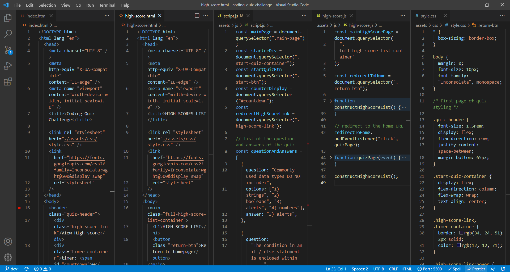
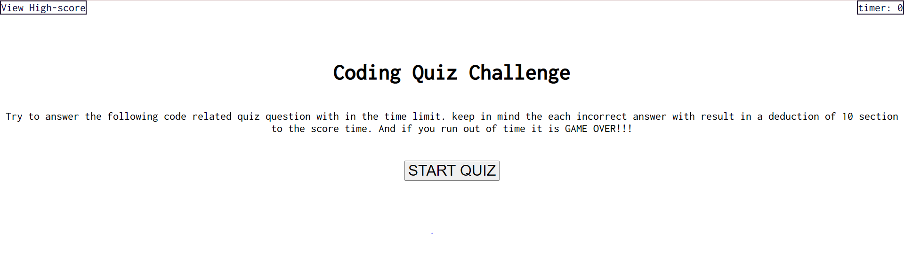
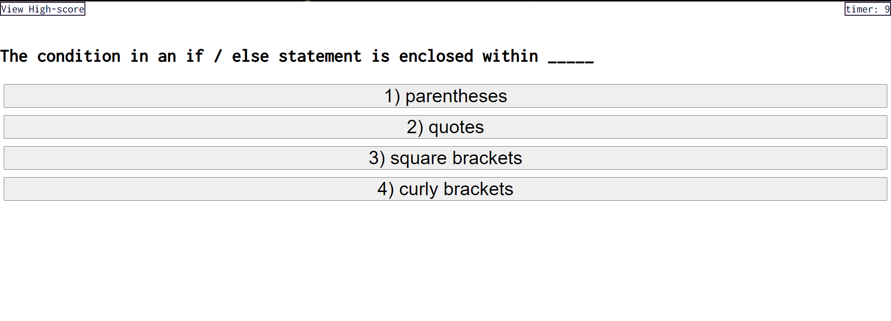
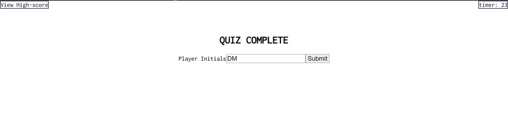

# coding-quiz-challenge

## Description:

Created a timed coding quiz with multiple choice questions without a framework. This quiz web application runs in the browser and features dynamically updating HTML , CSS and JavaScript code.

## Completed :

To see the full URL deployed web-application project <a href=https://dmo17.github.io/coding-quiz-challenge//>click here </a>

## Preview: Image Of HTML , CSS and JavaScript Code:

## Preview Image Of Web-page:

## Acceptance Criteria:

- GIVEN I am taking a code quiz
- WHEN I click the start button
- THEN a timer starts and I am presented with a question
- WHEN I answer a question
- THEN I am presented with another question
- WHEN I answer a question incorrectly
- THEN time is subtracted from the clock
- WHEN all questions are answered or the timer reaches 0
- THEN the game is over
- WHEN the game is over
- THEN I can save my initials and my score
